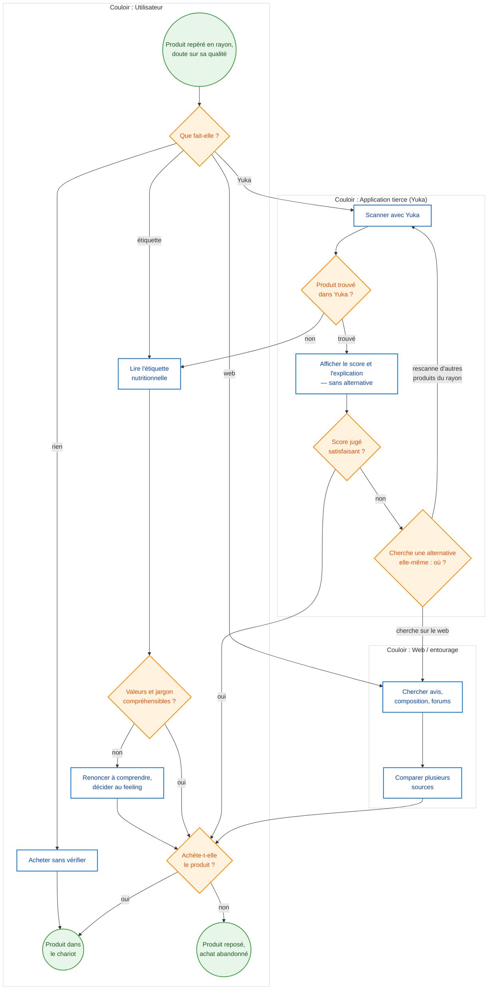
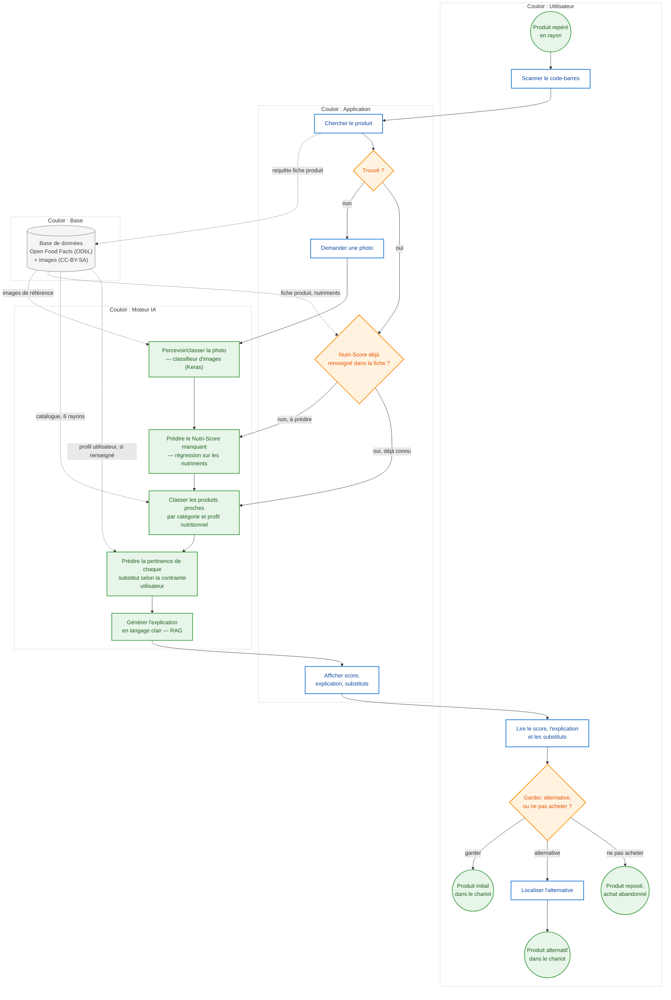

# Processus — du scan à la décision d'achat

## Objectif

Ce document cartographie, en BPMN simplifié, le parcours « du scan à la décision d'achat » : la carte **as-is** (sans NutriScope, avec les outils réels — étiquette, Yuka, web, ou rien) et la carte **to-be** (avec NutriScope, en couloirs *utilisateur / application / moteur IA / base*). La décision finale a trois issues, pas deux : garder le produit, choisir une alternative, ou ne pas acheter — renoncer à un produit inadapté faute de mieux est un résultat aussi légitime qu'un achat.

Le tableau qui suit l'as-is numérote et qualifie (fréquence, temps perdu, conséquence) ses points de friction ; la dernière section précise les trois activités où l'IA intervient dans le to-be (percevoir, classer, prédire, générer).

## Carte as-is — sans NutriScope

Le même déclencheur (« produit repéré en rayon, doute sur sa qualité ») débouche sur quatre comportements réels observés chez nos personas (TP 5) : lecture d'étiquette, scan Yuka, recherche web, ou aucune vérification. Léa (famille pressée) utilise surtout Yuka en rayon ; Inès (étudiante) et Sophie (diabétique) basculent plus souvent vers la lecture d'étiquette ou le renoncement, faute de réponse adaptée à leur contrainte (budget, pathologie) ; la recherche web intervient rarement en rayon et plutôt après coup, à la maison. Quel que soit le chemin pris, l'utilisatrice finit par une même décision à deux issues : acheter, ou reposer le produit. Le détail de chaque friction (fréquence, temps perdu, conséquence) est dans le tableau qui suit le schéma — la carte elle-même ne porte que leur numéro.

### Tableau des frictions (as-is)

| # | Friction | Type | Fréquence | Temps perdu | Conséquence |
|---|---|---|---|---|---|
| F1 | Produit non reconnu par Yuka (marques distributeur) | Rupture d'information | Occasionnelle, surtout sur les marques distributeur | 30 à 60 s de blocage en rayon avant de basculer vers l'étiquette | Abandon du contrôle nutritionnel, achat « par défaut » |
| F2 | Étiquette trop complexe à interpréter (tableau, jargon, %AJR) | Variabilité | Quasi systématique sans appli, ou en repli après un F1 | 1 à 2 min par produit, enfants qui attendent (Léa) | Décision « au feeling », perte de temps |
| F3 | Recherche web dispersée, rarement faite en rayon | Attente | Rare en magasin ; plus fréquente le soir, après achat (Sophie) | 5 à 15 min, hors du parcours d'achat | Apprentissage a posteriori seulement, risque de reproduire le même achat |
| F4 | Yuka ne propose aucune alternative : score et explication seulement, même si le produit ne convient pas (budget, diabète) | Rupture d'information | Systématique dès que le score est mauvais, plus pénalisant pour les profils à contrainte | 2 à 3 min pour chercher soi-même une alternative, en rescannant d'autres produits du rayon ou sur le web | Comparaison manuelle non systématique, perte de confiance dans l'outil |
| F5 | Aucune vérification faute de temps | Erreur et retour arrière | Fréquente en forte contrainte de temps | 0 en rayon, reporté (regret a posteriori) | Pas d'amélioration du choix dans la durée |

## Carte to-be — avec NutriScope

Le to-be ferme les cinq frictions de l'as-is : F1 et F3 disparaissent derrière une recherche fiable et un contrôle fait désormais en rayon, F2 derrière une explication générée en langage clair, F5 devient possible parce que la vérification est enfin assez rapide pour tenir dans les quelques secondes disponibles. F4 (Yuka n'offre aucune alternative) est traité à la racine : l'application cherche elle-même un substitut, filtré par le profil (budget, diabète) si connu, là où Yuka s'arrête au score. Ne pas acheter devient une issue nommée : un produit reposé faute de bonne alternative est un succès du parcours, pas un échec — une donnée à mesurer au même titre qu'un achat.

## Les trois activités où l'IA intervient

| Activité (to-be) | Ce qu'elle fait | Verbe(s) |
|---|---|---|
| Prédire le Nutri-Score manquant | À partir des nutriments essentiels, quand l'information officielle est absente de la fiche Open Food Facts | **Prédire** |
| Chercher des substituts proches | Regroupe les produits par catégorie/profil nutritionnel, puis évalue leur pertinence selon le produit scanné et la contrainte de l'utilisateur si connue | **Classer** puis **Prédire** |
| Générer l'explication | Rédige, en langage clair, l'explication du score et des substituts affichés | **Générer** |

Une quatrième capacité, la perception d'image (photo envoyée quand le produit est absent de la base), n'intervient qu'en repli — elle alimente la prédiction du score sans faire partie du chemin principal.

## Sources

- Personas (TP 5) : [docs/cadrage/personas.md](personas.md)
- Périmètre fonctionnel et données : [docs/perimetre.md](../perimetre.md)
- Notation et méthode : Module 2.3 — Analyse des processus, étude d'opportunité & de faisabilité (Utopios)
